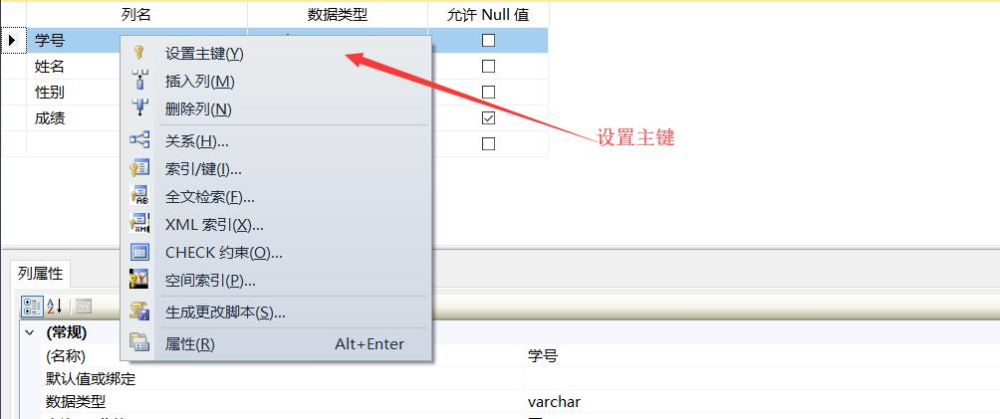
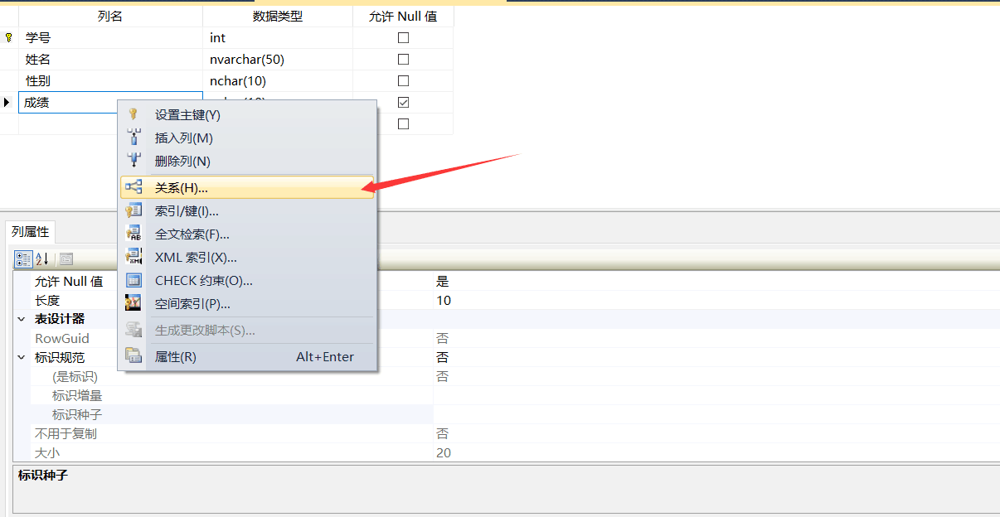

# ----------------------数据表管理------------------------

## :arrow_forward: 目录
<a href="#p1">:fast_forward:</a> 
<a href="#p2">:fast_forward:</a> 
<a href="#p3">:fast_forward:</a> 

## :arrow_double_down:数据表简介
<a href="#title">:arrow_up:回到目录</a> 
数据表是数据库中最重要的对象,数据库中所有的数据都是放在数据表里的,按照行列的格式进行组织.按照表的用途分类,可分为4类 
+ **系统表**: 系统表包括服务器的配置信息,数据表的定义信息,用于只有读取到权限,没有修改的权限,由SQLserver自己维护
+ **用户表**: 用户自己创建和维护,需要用于各种开发的表
+ **已分区表**: 已分区表是将数据水平划分为多个单元的表,这些单元可以分布到数据库的多个文件中(便于维护)
+ **临时表**: 临时表是由于系统或用户运算的临时需要而创建的表,只是临时的,使用完毕后就删除
#### :small_blue_diamond:数据类型
+ 精确数字型

数据类型|范围|储存长度
---|:--:|:--:
bigint|-2^63~2^63|8字节
int|-2^31~2^31|4字节
smallint|-2^15~2^15|2字节
tinyint|0~255|1字节
bit|0,1,Null|由列的大小+1个字节
+ 带固定类型和小数位数的数据类型

数据类型|范围|储存长度
---|:--:|:--:
numeric|-10^38+1~10^38+1|与精度有关
decimal|-10^38+1~10^38+1|与精度有关
+ 货币型

数据类型|范围|储存长度
---|:--:|:--:
money|-922337203685477.5808~922337203685477.5807|8字节
smallmoney|-214748.3648~214748.3647|4字节
+ 近似数字型

数据类型|范围|储存长度
---|:--:|:--:
float|-7.19E+308~7.19E-308|与数值有关
real|-3.40E+38~-1.18E-38及1.18E-38~3.40E+38|4字节
+ 日期和时间类型

数据类型|范围|储存长度
---|:--:|:--:
datetime|1753.1.1~9999.12.31|8字节
smalldatetime|1900.1.1~2079.6.6|4字节
+ 字符串类型

数据类型|范围|储存长度
---|:--:|:--:
char|1~8000个字符|一个字符一个字节,固定长度,如果插入字符不足,系统自动补上空格
varchar|1~8000个字符|一个字符占一个字节(大小与输入匹配)
text|1~2^31-1|一个字符占一个字节(大小与输入字符匹配),最大2GB
+ Unicode字符类型

数据类型|范围|储存长度
---|:--:|:--:
nchar|1~4000|一个字符占两个字节,为固定长度,入过插入的数据不够定义的长度,系统会自动补上空格
nvarchar|1~4000|一个字符占2个字节(大小与输入字符匹配)
ntext|1~20^30-1|最大2GB

**注意**: 在使用上，如果存储内容都是英文字符而没有汉字等其他语言符号，建议使用varchar；含有汉字的使用nvarchar，因为nvarchar是使用Unicode编码，即统一的字符编码标准，会减少乱码的出现几率；从空间上考虑，varcahr较合适；从效率上考虑，用char合适.
## :arrow_double_down:数据库建立
<a href="#title">:arrow_up:回到目录</a> 
#### :small_blue_diamond:视图工具创建表
+ 可以通过系统工具自己创建表:打开数据库->右击表->表 出现下图

填入数据,保存写入表面就创建成功,如果想重新设置,右击表->设计 就可以重新设置表

-------
+ **设置主键**: 主键是表的唯一标识符,只能有一个,但是可以将多个列选为一个主键,Ctrl+C可以选中多个列再右击设为主键.

---
+ **设置默认值**: 在设计模式下,选中表在下面的属性栏可以找到默认值,并设置一个默认值.在没有初始化这个数据之前,均采用这个默认值

---
+ **设置标识列**:  
   + 标识规范:选项用来设置是否自动增涨
   + 标识种子:选项指定从哪个数字开始标识
   + 标识增量:选项指定一次增加多少
   

---
+ **建立表与表之间的关系**: 在数据表中,表与表之间并不完全的独立,我们可以使用外键来建立联系.比如在一个学生信息表中,有一项为成绩,当然成绩是由很多数据的,所以我们用成绩又做了一个表,我们可以通过成绩列设置一个外键,来指向成绩表主键,因为主键可以标识该表中唯一的记录,外键指向主键,所以两个键的类型和大小必须一致,段落名可以不一样,如下:

**添加好了之后,在视图的左上角,会有一个表关系的FK的联系表,在到右边的常规中的表和列项,点击那个...的按钮**

**注意外键与联系表的主键的类型与大小要一致,名字可以不一样**

---
+ **设置索引**: 使用索引,可以加快从表中或视图中检索行的速度,在后面介绍,这里你可以把索引当做一个排序,比如你要查第37号的信息,数据库会很快定位到学号为37的记录.如果没有建立索引,数据库就会将所有记录都搜索一遍才知道该记录是否存在.在本例中我们以学生学号为检索:

可以设置单个或者多个列为检索,也可以选择他是升序还是降序,保存退出

---
+ **设置约束**:设置约束可以对数据进行范围设置及规范输入
   + 设立Unique约束:Unique约束是指该字段下的数据不能有重复,但是可以有NUll.比如学号等这些数据不允许有重复值,虽然可以使用主键为唯一标识,但是主键只能有一个,所以我们需要使用Unique约束
   + Check约束:Check约束常用于限制数据位于那些范围中
   
   
---
+ **对于数据表有时储存的问题解决:**

#### :small_blue_diamond:T-SQL语言创建表
